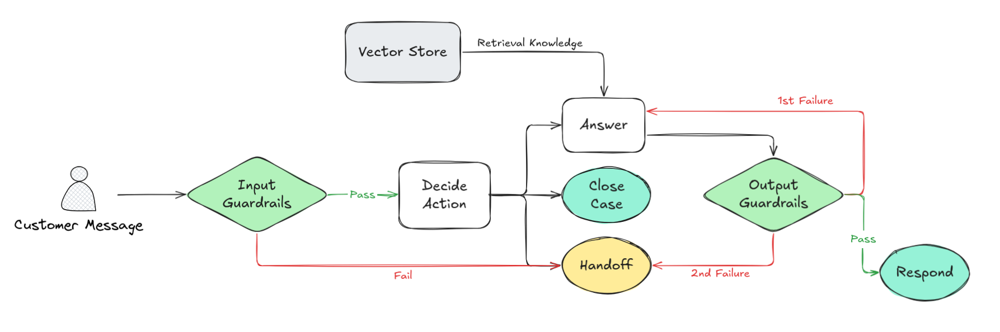
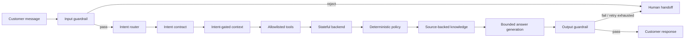

# Customer Ops Agent

An evaluation-first customer operations agent for Vietnamese fintech support.

The project explores a safety-first architecture for turning customer
messages into bounded operational outcomes: retrieve only the context an
intent is allowed to see, apply verified policy, call allowlisted tools, and
answer or hand off with an auditable trace.

This is a portfolio-grade prototype and architecture demonstration. It uses
real public policy sources and a stateful simulated backend; it is not
connected to a live customer account or production banking system.

## Architecture



The central design decision is that the LLM is not the system of record. The
application owns policy, authorization, state transitions, tool execution,
and failure handling.



### Runtime boundaries

| Layer | Responsibility | Source of truth |
| --- | --- | --- |
| Input guardrail | Reject blank, oversized, or instruction-hijacking input | Application code |
| Intent router | Propose intent, slots, action, and tool | Rule baseline or structured LLM output |
| Intent contract | Enforce confidence, required slots, context scopes, and allowed actions | Typed Pydantic contract |
| Context layer | Expose only transaction/refund data permitted by the intent | `CaseState` |
| Tool layer | Dispatch only named, validated operations | `MockBackend` and tool allowlist |
| Policy layer | Decide timing, eligibility, destination, and handoff | Deterministic policy table |
| Knowledge layer | Retrieve active, audience-filtered, source-backed documents | Local policy corpus |
| Answer layer | Improve tone without changing policy facts | Structured answer contract |
| Output guardrail | Validate mandatory facts and fail closed | Application code |
| Review/evaluation | Measure behavior before release | Golden cases and review artifacts |

## End-to-end workflow

For a cashback-not-received case:

1. The input guardrail validates the customer message.
2. The router identifies `missing_refund` and extracts an explicit transaction ID.
3. The intent contract authorizes refund context and `get_refund_status`.
4. The backend returns a realistic, stateful fixture.
5. Deterministic policy evaluates the verified facts: within 24 hours,
   ineligible service, account limit, monthly limit, or overdue handoff.
6. The knowledge layer retrieves the active official policy document.
7. The answer layer may rewrite tone, but cannot change the policy key, source,
   deadline, destination, or action.
8. The output guardrail either releases the answer or hands the case to a human.

The same runtime supports bank-transfer and Google Play refund boundaries while
preventing one workflow's policy from leaking into another.

## Safety and correctness principles

### The model proposes; the runtime decides

The model can propose a typed route. It cannot invent a transaction ID, select
an unrelated tool, choose a policy source, or create a customer-facing promise.
The application validates the proposal against the intent contract before any
tool call.

### Context is intent-gated

`CaseState` is the durable source of truth between triage, tools, and response.
Transaction and refund context must declare their scope, and unknown fields
are rejected. Raw names, phone numbers, tokens, and account credentials do not
belong in the state contract.

### Policy is source-backed and deterministic

Public policy documents carry their source URL, audience, topic, checked date,
and lifecycle status. The policy engine turns verified facts into bounded
outcomes; retrieval supplies evidence, not authority to invent new rules.

### Fail closed

An input violation, invalid tool result, unavailable source, answer-generation
failure, or output-guardrail failure becomes a visible handoff. The system does
not answer from incomplete account facts.

### Evaluation is part of the product

The project evaluates routing, tool calls, state outcomes, policy grounding,
workflow boundaries, and customer-facing answers. A passing automated suite is
separate from human approval; reviewed output is required before a workflow is
considered release-ready.

## Current workflow coverage

| Workflow | What it demonstrates | Status |
| --- | --- | --- |
| `cashback_not_received_v1` | Source-backed policy branches, answer generation, human review | Flagship |
| `bank_transfer_not_received_v1` | Reconciliation windows, return destinations, overdue handoff | Source-backed |
| `google_play_refund_v1` | Product boundary and instruction-only answer | Source-backed |
| `workflow_boundaries_v1` | Preventing cross-workflow policy contamination | Regression suite |

## Evaluation results

The current offline results are:

- `65/65` unit and integration tests;
- `93/93` cases in the unified release gate;
- `60` synthetic routing cases;
- `33` source-backed and boundary cases;
- `8/8` automated QA checks for the flagship cashback review pack;
- `8` flagship cases intentionally pending human approval.

The numbers are reproducible offline and should not be interpreted as a
production accuracy or customer-resolution claim.

Run the complete release gate:

```bash
uv run python scripts/run_release_gate.py
```

Run all tests:

```bash
uv run python -m pytest -q
```

## Human review and pitch demo

Generate the flagship review pack:

```bash
uv run python scripts/run_answer_qa.py --harness rule
```

Review `artifacts/qa/cashback_not_received_v1.json`, set each record to
`approved` or `rejected`, and add reviewer notes. Then run:

```bash
uv run python scripts/run_review_gate.py
```

The gate remains blocked while any case is pending or rejected. If the
generated response or policy identity changes, its previous approval is reset.

Show the flagship workflow in four representative branches:

```bash
uv run python scripts/run_flagship_demo.py
```

For an optional LLM wording pass:

```bash
uv run --env-file .env --extra openai python scripts/run_answer_qa.py \
  --harness openai --model gpt-5.6-luna
```

## Development roadmap

The roadmap deliberately increases operational capability only after the
preceding safety and evaluation layer is working.

### Phase 1 — Bounded prototype *(current)*

- typed case and intent contracts;
- deterministic guardrails and policy decisions;
- source-backed retrieval;
- stateful simulated tools;
- component, workflow, boundary, and end-to-end evaluation;
- human-review artifact and release gate.

### Phase 2 — Human-reviewed flagship

- expand the flagship set to 30–50 diverse conversations;
- have domain reviewers approve or reject every answer;
- classify failures by routing, retrieval, policy, wording, and tool state;
- turn every reviewed failure into a regression case;
- track handoff rate, answer acceptance, review disagreement, and latency.

### Phase 3 — Process orchestration

- express multi-step operational processes as versioned, human-readable
  workflow definitions;
- add simulated users for multi-turn conversations;
- model state-changing tools and idempotency explicitly;
- grade final environment state, not only the final message;
- add workflow-level plans that update as new facts arrive.

### Phase 4 — Shadow and controlled pilot

- connect authenticated, read-only internal adapters;
- add PII redaction, audit logging, access control, rate limits, and rollback;
- run the agent in shadow mode while humans remain the sender of record;
- sample every output initially, then reduce sampling only with evidence;
- establish operational dashboards and incident procedures.

### Phase 5 — Evidence-led expansion

- select the next workflow from support volume, repeatability, and risk;
- reuse the same contracts, guardrails, review loop, and release gate;
- expand tools only when the simulated environment and end-to-end evals are
  ready;
- keep sensitive, ambiguous, or low-confidence cases with human specialists.

## Repository map

```text
src/customer_ops_agent/
├── contracts.py       # typed case state, intents, scopes, transitions
├── guardrails.py      # input/output validation and safe handoff
├── agent_harness.py   # rule baseline and structured LLM router
├── mock_backend.py    # stateful, idempotent offline tools
├── policies.py        # deterministic source-backed policy decisions
├── knowledge.py       # local source-filtered retrieval
├── answering.py       # bounded answer generation
├── qa.py              # answer QA and human-review gate contracts
└── evaluation.py      # golden cases, tools, and outcomes

data/
├── golden/            # synthetic, source-backed, and boundary evaluations
└── knowledge/         # versioned policy documents and metadata

scripts/
├── run_release_gate.py
├── run_answer_qa.py
├── run_review_gate.py
└── run_flagship_demo.py
```

## Honest scope

This repository demonstrates the architecture and engineering discipline
needed for a production customer-operations agent. It does not claim live
banking integration, real customer traffic, completed domain approval, or
production KPI improvements. Those are explicit future phases rather than
hidden assumptions.

## Related design documents

- [Case state and intent contract](docs/case-state.md)
- [Guardrails](docs/guardrails.md)
- [Knowledge base](docs/knowledge.md)
- [Answer generation](docs/answering.md)
- [Human review loop](docs/review-loop.md)
- [Evaluation design](docs/evaluation.md)
